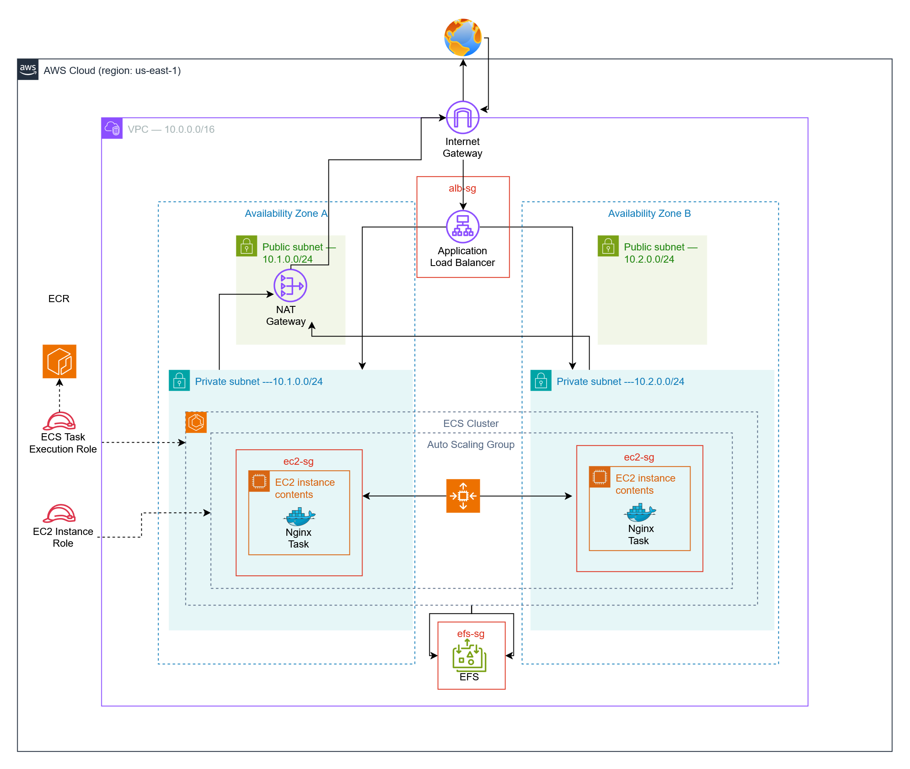

# ECS (EC2 Launch Type) + EFS + ALB + CloudWatch - Terraform Project

## Overview

A complete infrastructure for running Nginx on AWS ECS using the EC2 launch type with shared persistent storage via EFS, load balancing through ALB, and centralized logging to CloudWatch. Everything is provisioned using Terraform.

---

## Architecture



---

## What This Deploys

| Component | Details |
|-----------|---------|
| **VPC** | 2 public + 2 private subnets across 2 AZs |
| **Internet Gateway** | For public subnet internet access |
| **NAT Gateway** | For private subnet outbound internet |
| **ALB** | Application Load Balancer in public subnets |
| **Security Groups** | ALB (port 80), ECS (only from ALB), EFS (NFS only from ECS) |
| **EC2 Instances** | ECS-optimized AMI with EFS mounted |
| **ECS Cluster** | EC2 launch type with Container Insights |
| **Nginx Service** | 2 tasks running Nginx container |
| **EFS** | Encrypted shared file system |
| **CloudWatch** | Log group for Nginx container logs |
| **IAM** | Instance profile + task execution role |
| **Session Manager** | Secure instance access without SSH |

---

## Prerequisites

```bash
aws --version                 # AWS CLI installed and configured
terraform -version            # Terraform v1.5+
session-manager-plugin --version   # For SSM connections
git --version
```

### Configure AWS Credentials

```bash
aws configure
```
Enter Access Key, Secret Key, region (us-east-1), and output format (json).

---

## Quick Start

```bash
cd terraform
terraform init
terraform plan
terraform apply
```

Type `yes` when prompted. Takes 5-8 minutes.

### Get ALB DNS Name

```bash
terraform output alb_dns_name
```

Visit the URL - you'll see **403 Forbidden** (this is expected because EFS is empty).

### Add Content to EFS

```bash
# Get EC2 instance ID
aws ec2 describe-instances --filters "Name=tag:Name,Values=*ecs-instance*" --query "Reservations[*].Instances[*].InstanceId" --output text

# Connect via Session Manager
aws ssm start-session --target i-xxxxxxxxxxxxx

# Create content on EFS
sudo bash -c 'echo "<h1>Hello from EFS-backed Nginx</h1>" > /mnt/efs/index.html'

# Verify
cat /mnt/efs/index.html

# Exit
exit
```

Refresh your browser - you'll see your custom message!

### Clean Up

```bash
terraform destroy
```

---

## Project Structure

```
ecs-ec2-efs-nginx/
├── README.md
├── .gitignore
├── diagrams/
│   └── architecture-diagram.png
├── screenshots/
│   ├── 01-ecs-cluster-console.png
│   ├── 02-ec2-targetgroup.png
│   ├── 03-cloudwatch-logs.png
│   ├── 04-efs-mounts.png
│   ├── 05-cli.png
│   └── 06-browser.png
└── terraform/
    ├── main.tf
    ├── variables.tf
    ├── outputs.tf
    ├── providers.tf
    └── modules/
        ├── vpc/
        ├── security-groups/
        ├── iam/
        ├── efs/
        ├── alb/
        ├── cloudwatch/
        └── ecs/
```

---

## Verification Checklist

| Step | Expected Result |
|------|----------------|
| `terraform apply` | Success with outputs |
| ECS Console | Tasks show "RUNNING" |
| Target Groups | Instances "healthy" |
| ALB DNS (initially) | 403 Forbidden (EFS empty) |
| After adding content via SSM | Custom page appears |
| CloudWatch | Logs visible |
| EFS Mount Targets | 2 targets in different AZs |

---

## Issues & Solutions

### Issue 1: Session Manager Plugin Not Found (Windows)

**Error:** `SessionManagerPlugin is not found`

**Cause:** Plugin not in PATH

**Solution (Quick Fix):**
```powershell
$env:Path += ";C:\Program Files\Amazon\SessionManagerPlugin\bin\"
```

**Solution (Permanent):**
1. Press Windows key, type "environment variables"
2. Click "Edit environment variables for your account"
3. Select "Path" → "Edit"
4. Add: `C:\Program Files\Amazon\SessionManagerPlugin\bin\`
5. Click OK, restart PowerShell

---

### Issue 2: Session Manager - TargetNotConnected

**Error:** `TargetNotConnected`

**Cause:** EC2 instance missing SSM Agent or IAM policy

**Solution 1: Add SSM Agent to user-data in `modules/ecs/main.tf`**
```hcl
yum install -y amazon-ssm-agent
systemctl enable amazon-ssm-agent
systemctl start amazon-ssm-agent
```

**Solution 2: Add IAM policy in `modules/iam/main.tf`**
```hcl
resource "aws_iam_role_policy_attachment" "ssm_policy" {
  role       = aws_iam_role.ecs_instance_role.name
  policy_arn = "arn:aws:iam::aws:policy/AmazonSSMManagedInstanceCore"
}
```

**Apply changes:**
```bash
terraform plan
terraform apply
```

---

### Issue 3: 403 Forbidden on ALB

**Error:** Browser shows "403 Forbidden"

**Cause:** EFS is empty, mount overwrites default Nginx files

**Solution:** Create index.html on EFS via Session Manager
```bash
sudo bash -c 'echo "<h1>Hello from EFS-backed Nginx</h1>" > /mnt/efs/index.html'
```

---

## Costs

| Resource | Cost |
|----------|------|
| NAT Gateway | ~$0.045/hour |
| ALB | ~$0.0225/hour |
| EC2 (t3.micro) | ~$0.0104/hour each |
| EFS | ~$0.30/GB-month |

**Always run `terraform destroy` when done!**

---

## Tech Stack

- **Infrastructure:** Terraform
- **Cloud:** AWS (VPC, ECS, EFS, ALB, IAM, CloudWatch)
- **Container:** Nginx on Docker
- **Orchestration:** ECS (EC2 Launch Type)
- **Access:** Systems Manager Session Manager
